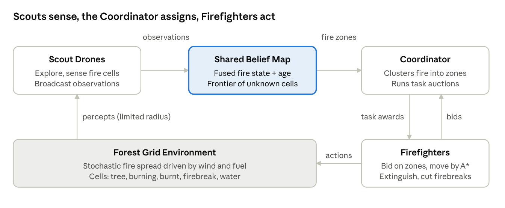

# Wildfire Containment Squad — Review 1

## 1. Introduction

Wildfire Containment Squad is a multi-agent system in which scout drones and firefighter agents cooperate to contain a wildfire that spreads stochastically across a simulated forest grid. The goal is to save as much forest as possible within a fixed time budget, with no single agent able to see or fight the whole fire alone.

**Problem statement.** A wildfire spreads faster than any one responder can act, visibility is limited by smoke and distance, and wind changes which way the fire moves. Effective containment needs three things at once: finding the fire, deciding who fights which part of it, and moving responders there efficiently. This is naturally a multi-agent problem.

**Objectives**

1. Model the forest as a dynamic, partially observable grid environment with a probabilistic fire-spread model influenced by wind and fuel.
2. Design two cooperating agent types with distinct roles: Scout Drones (perception) and Firefighters (action), plus a lightweight Coordinator for task allocation.
3. Use informed search (A\*) for navigation and a market-based auction for task allocation.
4. Show, through controlled test scenarios, that coordinated agents save measurably more forest than independent agents.

**Scope.** The project is a software simulation in Python. It does not model real terrain data, 3D smoke physics or aircraft. Those are listed as future scope.

## 2. System overview

The system separates perception from action: scouts build a shared picture of the fire, the Coordinator turns that picture into tasks, and firefighters execute them. This division of labour is what makes it a genuine multi-agent system rather than several agents working side by side.



*System architecture · 3 agent types, 1 shared map, 1 environment*

Read the loop clockwise from the bottom: the environment produces local percepts, scouts fuse them into the shared map, the Coordinator auctions fire zones, firefighters bid and act, and their actions change the environment.

| Agent | Default count | Role | Can act on fire? |
| --- | --- | --- | --- |
| Scout Drone | 3 | Explore the forest, detect burning cells, share observations | No |
| Firefighter | 5 | Win zone auctions, travel with A\*, extinguish cells and cut firebreaks | Yes |
| Coordinator | 1 | Cluster known fire into zones, run auctions, re-assign when zones change | No |

Agent counts are configurable, which is what the scalability tests in Section 9 vary.

## 3. PEAS formulation

Each agent type has its own PEAS because each perceives and acts differently. All three share one system-level performance measure, so their individual goals pull in the same direction.

**System performance measure.** The episode score rewards forest saved and penalises slow containment and agents caught in fire:

$$
\text{Score} = w_1 \cdot \frac{T_{\text{saved}}}{T_{\text{initial}}} \; - \; w_2 \cdot \frac{t_{\text{contain}}}{t_{\max}} \; - \; w_3 \cdot \frac{A_{\text{lost}}}{A_{\text{total}}}
$$

Here T is tree cells, t is simulation steps, A is firefighter agents, and the default weights are w1 = 0.7, w2 = 0.2 and w3 = 0.1. The fire counts as contained when no burning cell remains.

### 3.1 Scout Drone

| PEAS | Description |
| --- | --- |
| Performance | Share of burning cells detected within 5 steps of ignition; share of the grid explored; freshness (low average age) of the belief map |
| Environment | Forest grid seen from above; fire, smoke and wind; other drones; cannot be damaged by fire |
| Actuators | Fly one cell in 8 directions or hover; broadcast observations to the shared map |
| Sensors | Downward camera with a radius of 3 cells returning each cell's state; wind sensor for speed and direction; own GPS position |

### 3.2 Firefighter

| PEAS | Description |
| --- | --- |
| Performance | Burning cells extinguished; firebreak cells cut in front of the fire; zones contained; not being caught in fire |
| Environment | Forest grid on the ground; burning, burnt, tree, water and firebreak cells; other firefighters; limited water supply |
| Actuators | Move one cell in 4 directions; extinguish an adjacent burning cell; cut a firebreak on an adjacent tree cell; refill at a water cell; send bids to the Coordinator |
| Sensors | Local view with a radius of 1 cell; read access to the shared belief map; own position and water level; task awards from the Coordinator |

### 3.3 Coordinator

| PEAS | Description |
| --- | --- |
| Performance | Total travel cost of assignments (lower is better); share of fire zones with at least one firefighter; number of idle firefighters (lower is better) |
| Environment | The shared belief map and the firefighter team; it has no physical body on the grid |
| Actuators | Announce fire zones for auction; award zones to winning bidders; re-open auctions when zones merge, split or burn out |
| Sensors | The shared belief map; bids received from firefighters; task-completion messages |

## 4. Environment analysis

The environment is partially observable, stochastic, sequential, dynamic, discrete and cooperative multi-agent. That combination is the hardest mix among the standard properties, and every design choice in Sections 5 to 8 answers one of them.

| Property | Classification | Justification | What it forces in the design |
| --- | --- | --- | --- |
| Observability | Partially observable | Scouts see a radius of 3 cells and firefighters a radius of 1; no agent sees the whole grid | A shared belief map with a timestamp per cell |
| Determinism | Stochastic | Each step, a burning cell ignites a neighbour with a probability that depends on wind and fuel | Plans are re-computed as the fire moves; nothing is planned once |
| Episodic vs sequential | Sequential | A firebreak cut now changes which cells can burn later | Agents reason about future spread, not just the current state |
| Static vs dynamic | Dynamic | The fire spreads every step whether or not agents act | Fast algorithms (A\* with a good heuristic) and bounded re-planning |
| Discrete vs continuous | Discrete | Grid cells, a finite set of cell states and actions, and discrete time steps | Search over a finite state space is well defined |
| Single vs multi-agent | Multi-agent, cooperative | 9 agents share one team score | Coordination through a shared map and auctions; conflicts over zones and cells |
| Known vs unknown | Known rules, unknown state | The spread model is known to agents, but where the fire currently is must be discovered | Scouts explore; the Coordinator can use the spread model to predict fire fronts |

**Cell states.** Each cell is one of: Tree (fuel), Burning, Burnt, Firebreak, Water or Empty ground. Only Tree cells can ignite.

**Fire-spread model.** At each step, a Tree cell next to a Burning cell ignites with probability:

$$
P(\text{ignite}) = p_{\text{base}} \times f_{\text{fuel}} \times \left(1 + k \cdot \cos\theta\right)
$$

Here p\_base = 0.3 by default, f\_fuel is 1.0 for dense forest and 0.5 for sparse forest, θ is the angle between the wind direction and the direction of spread, and k = 0.8 sets wind strength. Downwind spread (θ = 0) is therefore up to 1.8 times the base rate, while upwind spread (θ = 180°) drops to 0.2 times. A burning cell becomes Burnt after 4 steps.

## 5. Agent analysis

Scouts are goal-based agents, while Firefighters and the Coordinator are utility-based. A simple reflex agent fails in this environment because it has no memory of cells it cannot currently see, and the fire is almost always partly out of view.

| Agent | Architecture | Internal state (model) | Why not something simpler |
| --- | --- | --- | --- |
| Scout Drone | Model-based, goal-based | Its copy of the belief map, with the last-seen time of every cell | A reflex scout would circle the fire it already sees and never find new ignitions |
| Firefighter | Model-based, utility-based | Position, water level, assigned zone, current A\* path | A goal-based firefighter treats every burning cell as equally good; utility lets it prefer cells that stop the most future spread |
| Coordinator | Utility-based | List of fire zones, open auctions, current assignments | It must trade off distance, threat and coverage across the whole team, which needs a numeric utility |

### 5.1 Scout decision cycle

1. Sense: read every cell within radius 3 and the wind.
2. Update: write observations and timestamps to the shared belief map.
3. Choose goal: the frontier cell with the highest exploration value, where value = age of the information ÷ (1 + distance). Unknown cells count as the oldest.
4. Act: move one step toward the goal on the shortest path.

### 5.2 Firefighter decision cycle

1. Sense: read the local radius-1 view, the belief map and any auction announcements.
2. Bid: for each announced zone, send a bid equal to its utility for that zone (Section 6.4).
3. On award: plan a path to the zone with A\*.
4. Act by priority: if water = 0, refill at the nearest water cell. Otherwise, if a burning cell is adjacent, extinguish it. Otherwise, if at the zone's downwind edge, cut a firebreak. Otherwise, take the next A\* step.
5. Re-plan when the path becomes blocked by fire or the zone is reported contained.

### 5.3 Coordinator decision cycle

1. Every 5 steps, group burning cells on the belief map into zones using connected components.
2. Rank zones by threat: zone size × average downwind ignition probability.
3. Announce new or changed zones for auction, collect bids and award each zone to the best bidder.
4. Release a firefighter back to the pool when its zone is contained.

## 6. Algorithmic modeling

The overall problem breaks into three sub-problems, each with its own algorithm: finding the fire (frontier exploration), deciding who goes where (sequential single-item auction), and getting there safely (risk-aware A\*).

### 6.1 Formal problem formulation (navigation)

Navigation is the core search problem that every firefighter solves repeatedly.

| Element | Definition |
| --- | --- |
| State | Firefighter position (x, y) on a 50 × 50 grid |
| Initial state | Current position of the firefighter |
| Actions | Move North, South, East or West into a cell that is not Burning and not Water |
| Transition model | Position changes by one cell; the move is illegal if the target cell is outside the grid or blocked |
| Goal test | Position is adjacent to the assigned zone's target cell |
| Path cost | Sum of step costs, where each step costs 1 + λ × risk of the cell entered (defined below) |

### 6.2 Formal problem formulation (whole system)

| Element | Definition |
| --- | --- |
| State | State of every cell + position, water and task of every agent + wind |
| Initial state | 1 to 3 ignition points on a random or preset forest map; all agents at the base station |
| Actions | The joint action of all agents in one step |
| Transition model | Apply agent actions, then apply stochastic fire spread (Section 4) |
| Goal test | No Burning cell remains, or the step limit t\_max = 300 is reached |
| Objective | Maximise the Score from Section 3 |

This joint state space is far too large to search directly, since each of 2,500 cells has 6 states. That is why the design decomposes it into small per-agent searches plus auction-based coordination.

### 6.3 Risk-aware A\* for firefighter navigation

Each step's cost adds a penalty for entering cells likely to ignite soon, so firefighters avoid being trapped by the fire front:

$$
c(n) = 1 + \lambda \cdot \text{risk}(n), \qquad \text{risk}(n) = \max_{b \in \text{burning neighbours}} P(\text{ignite from } b)
$$

The default is λ = 5. The heuristic is Manhattan distance:

$$
h(n) = |x_n - x_{\text{goal}}| + |y_n - y_{\text{goal}}|
$$

**Admissibility.** Every step costs at least 1 and each step changes x or y by exactly 1, so h(n) never overestimates the true remaining cost. A\* with this heuristic therefore returns an optimal path. The heuristic is also consistent, so no node needs re-expanding.

**Re-planning.** Because the environment is dynamic, a firefighter re-runs A\* when its next cell starts burning or every 10 steps, whichever comes first.

### 6.4 Sequential single-item auction for task allocation

The Coordinator auctions zones in order of threat. Each free firefighter f bids its utility for zone z:

$$
U(f, z) = \frac{\text{threat}(z)}{1 + \text{pathcost}(f, z)} \times \frac{\text{water}_f}{\text{water}_{\max}}
$$

Threat(z) is zone size × average downwind ignition probability, and pathcost comes from A\*. The highest bidder wins; zones with more than 20 burning cells are auctioned twice so two firefighters can be assigned.

```
for zone in sorted(zones, key=threat, reverse=True):
    bids = {f: U(f, zone) for f in free_firefighters}
    if bids:
        winner = max(bids, key=bids.get)
        assign(winner, zone)
        free_firefighters.remove(winner)
```

### 6.5 Frontier-based exploration for scouts

Scouts treat the belief map as a set of frontier cells, meaning unknown or stale cells next to known ones. Each scout picks the frontier cell maximising age ÷ (1 + distance). To stop scouts duplicating work, a scout publishes its chosen target, and others exclude targets within 5 cells of a published one.

### 6.6 Shared belief map

The belief map stores, for every cell, its last observed state and the step when it was observed. When two observations of one cell arrive, the newer one wins. Cells not seen for more than 15 steps are marked stale and become frontier cells again, which keeps the scouts moving.

## 7. Search strategy justification

A\* is chosen for navigation because it is the only candidate that is both optimal under varying step costs and fast enough to re-plan every few steps. For task allocation, the auction is chosen because it is decentralised and cheap, while staying close to the optimal assignment.

### 7.1 Navigation: candidate search algorithms

| Algorithm | Complete | Optimal with risk costs | Time / space | Verdict |
| --- | --- | --- | --- | --- |
| BFS | Yes | No; it assumes every step costs the same, so it ignores fire risk | O(b^d) / O(b^d) | Rejected |
| DFS | No on graphs with cycles unless tracked; paths can be very long | No | O(b^m) / O(bm) | Rejected |
| Uniform-cost search | Yes | Yes | Expands in every direction; slow when re-planning often | Baseline for comparison |
| Greedy best-first | No | No; it can walk straight into high-risk cells | Fast, but unreliable | Rejected |
| **A\* (Manhattan)** | **Yes** | **Yes, since h is admissible** | Expands far fewer nodes than UCS | **Chosen** |

On a 50 × 50 grid there are at most 2,500 nodes, so a single A\* call is bounded and cheap. In Review 2 we will measure nodes expanded by UCS versus A\* to show the heuristic's benefit with real numbers.

### 7.2 Task allocation: candidate strategies

| Strategy | How it assigns | Strength | Weakness | Verdict |
| --- | --- | --- | --- | --- |
| Independent agents | Each firefighter walks to the nearest fire it knows of | Simplest | Many agents pile onto the same zone, while others burn freely | Baseline for comparison |
| Greedy nearest | Coordinator sends each zone its closest firefighter | Simple, fast | Ignores threat, so large downwind fires can be left unattended | Baseline for comparison |
| Hungarian algorithm | Centrally computes the optimal one-to-one assignment | Optimal for a fixed snapshot | O(n³) each time zones change; needs full central knowledge | Rejected as the main method |
| **Sequential single-item auction** | Zones auctioned by threat; agents bid their own utility | Decentralised: each agent evaluates its own cost; handles changing zones; cost is roughly O(Z × F) A\* calls | Not guaranteed optimal | **Chosen** |

Z is the number of zones and F the number of free firefighters. Both are small (typically under 10), so an auction round costs a few dozen A\* calls at most.

### 7.3 Why these choices fit the environment

- **Dynamic:** A\* is fast enough to re-run whenever the fire blocks a path.
- **Stochastic:** risk-weighted costs make paths robust to likely spread instead of assuming the fire stays still.
- **Partially observable:** agents plan on the shared belief map, not on ground truth they cannot see.
- **Multi-agent:** the auction lets every agent contribute its own cost estimate, which a central planner would have to guess.

## 8. Multi-agent coordination and conflict resolution

Agents coordinate in two ways: implicitly, by reading and writing the shared belief map, and explicitly, through auction messages. Every foreseeable conflict between agents has a defined resolution rule.

### 8.1 Message protocol

| Message | From → To | Contents | When sent |
| --- | --- | --- | --- |
| OBSERVE | Scout → Belief map | Cell states seen, step number | Every step |
| TARGET | Scout → Other scouts | Chosen frontier cell | When a scout picks a new target |
| ANNOUNCE | Coordinator → Firefighters | Zone id, cells, threat score | When a zone appears, merges or splits |
| BID | Firefighter → Coordinator | Zone id, utility value | In reply to ANNOUNCE, if free |
| AWARD | Coordinator → Firefighter | Zone id, target cell | After bids close |
| DONE | Firefighter → Coordinator | Zone id, status (contained / abandoned) | When the zone has no burning cells or the agent must retreat |

### 8.2 Conflicts and how they are resolved

| Conflict | Example | Resolution |
| --- | --- | --- |
| Two firefighters want the same zone | Both are close to the largest fire | Auction: the higher utility wins; the loser bids on the next zone |
| Two agents want the same cell in one step | Paths cross in a narrow gap | Reservation: agents move in a fixed order each step; a cell already reserved is treated as blocked, and the later agent waits or re-plans |
| Two scouts explore the same area | Both find the same stale region most valuable | Published TARGET messages; targets within 5 cells of another scout's target are excluded |
| Conflicting observations of one cell | A scout saw it burning at step 40; a firefighter saw it burnt at step 42 | The newest timestamp wins |
| Path blocked by new fire | The fire front crosses a planned route | Re-run A\*; if no safe path exists, send DONE with status abandoned and re-enter the auction |
| Firefighter out of water mid-task | Water reaches 0 inside the zone | Go to refill, keep the zone, and the Coordinator re-auctions it if the agent is gone more than 15 steps |

### 8.3 Why cooperation beats independent agents

Without coordination, firefighters crowd the nearest visible fire, and unseen or distant ignitions spread unchecked. The shared map fixes the visibility problem, and the auction fixes the crowding problem. Section 9 tests exactly this claim.

## 9. Implementation and testing plan (for Review 2)

The system will be built in Python with Mesa, and tested on six scenarios comparing coordinated agents against two baselines. This section previews Review 2 so evaluators can see the design is buildable.

### 9.1 Tools

| Tool | Purpose | Why this one |
| --- | --- | --- |
| Python 3 | Implementation language | Team familiarity; strong libraries |
| Mesa | Agent-based modelling: grid, scheduler, browser visualisation | Built for multi-agent simulations; live grid view for the demo |
| NumPy | Grid state and spread probabilities | Fast array operations on 2,500 cells |
| heapq (standard library) | Priority queue for A\* | No extra dependency |
| Matplotlib | Result charts for the test report | Standard, simple |

### 9.2 Planned code structure

```
wildfire_squad/
├── config.yaml            # grid size, agent counts, wind, weights
├── model.py               # WildfireModel: grid, scheduler, step loop
├── environment/
│   └── fire.py            # spread model, cell states
├── agents/
│   ├── scout.py
│   ├── firefighter.py
│   └── coordinator.py
├── algorithms/
│   ├── astar.py
│   ├── auction.py
│   └── frontier.py
├── belief_map.py
├── run_experiments.py     # batch runs + metrics
└── app.py                 # Mesa visualisation
```

Every parameter lives in config.yaml, so the same code runs 3 agents or 30 without changes.

### 9.3 Test scenarios

Each scenario will be run 30 times with different random seeds, and averages reported.

| # | Scenario | What it tests |
| --- | --- | --- |
| 1 | Calm wind, 1 ignition | Baseline behaviour |
| 2 | Strong wind, 1 ignition | Handling of directional, fast spread; firebreak placement |
| 3 | 3 simultaneous ignitions far apart | Task allocation across zones |
| 4 | Scouts disabled | Value of shared perception under partial observability |
| 5 | 2, 5 and 10 firefighters | Scalability and diminishing returns |
| 6 | River splitting the forest, narrow crossings | Path conflicts and re-planning around blocked routes |

### 9.4 Strategies compared

1. Independent agents: no shared map, no auction.
2. Greedy nearest assignment with the shared map.
3. Full system: shared map + auction + risk-aware A\*.

### 9.5 Metrics

- Percentage of forest saved (primary).
- Steps until containment.
- Firefighters caught in fire.
- Average belief-map staleness in steps.
- A\* nodes expanded compared with uniform-cost search.

**Expected result.** The full system should save the most forest, with the largest margin in Scenarios 2 and 3, where coordination matters most.

## 10. Anticipated Q&A and presentation tips

These are the questions evaluators are most likely to ask, with short answers every team member should be able to give.

| Likely question | Answer |
| --- | --- |
| Why is this multi-agent and not one smart agent? | No single agent can see or reach the whole fire. Perception (scouts) and action (firefighters) are split, and they depend on each other through the shared map and auctions. |
| Why A\* and not BFS? | Step costs differ because of fire risk, so BFS is not optimal here. A\* with Manhattan distance is optimal and expands fewer nodes than UCS. |
| Is your heuristic admissible? | Yes. Every step costs at least 1 and moves exactly one cell, so Manhattan distance never overestimates. |
| What if the fire blocks the path mid-route? | The agent re-runs A\* on the updated map. If no safe path exists, it abandons the zone and re-enters the auction. |
| Why an auction instead of the Hungarian algorithm? | Zones change every few steps. The auction is decentralised, cheap to re-run and uses each agent's own cost, while the Hungarian method needs full central recomputation each time. |
| How do you handle partial observability? | A shared belief map with timestamps. Stale cells become frontier cells, so scouts revisit them. |
| What makes the environment stochastic? | Ignition is probabilistic and depends on wind and fuel, so the same state can lead to different next states. |
| Is the Coordinator a single point of failure? | Yes, in the current design. A fallback is for firefighters to switch to greedy nearest-zone behaviour if no AWARD arrives within 10 steps. We can mention this as a robustness extension. |
| How will you prove coordination helps? | By comparing three strategies over 30 seeded runs per scenario, with forest saved as the main metric. |
| What are the limitations? | 2D grid only, simplified spread model, instant communication, no terrain slope. These are future scope. |

### Presentation tips

- Open with the problem in one sentence, then show the architecture diagram from Section 2 before any detail.
- Present PEAS as the three tables, and point out that all agents share one performance measure.
- Spend the most time on Sections 6 and 7: the formal formulation, the A\* admissibility argument and the auction. This is where the 3 marks for algorithmic modeling are earned.
- Have each team member own one section and practise answering the table above without notes.
