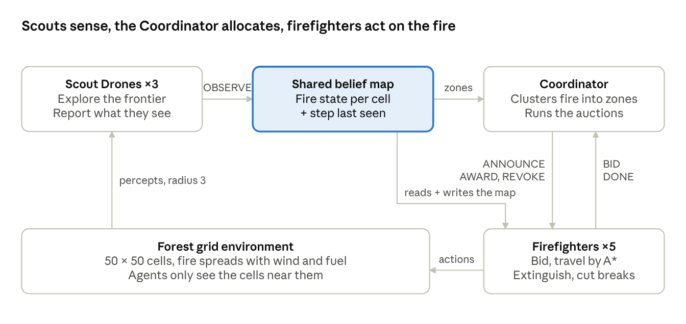
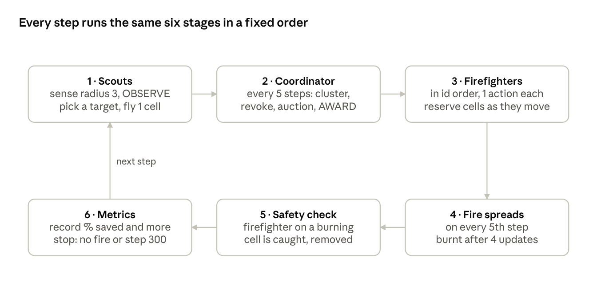
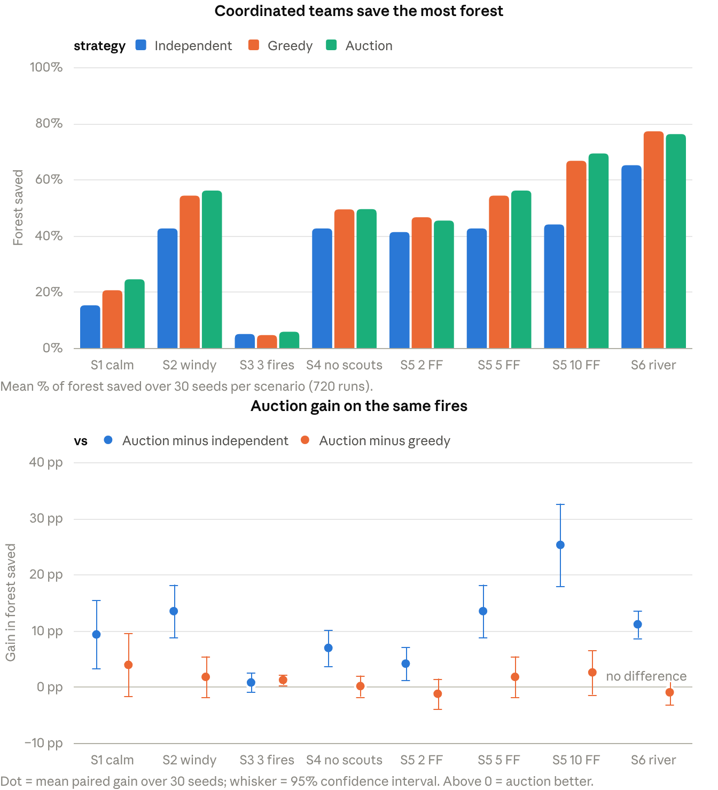
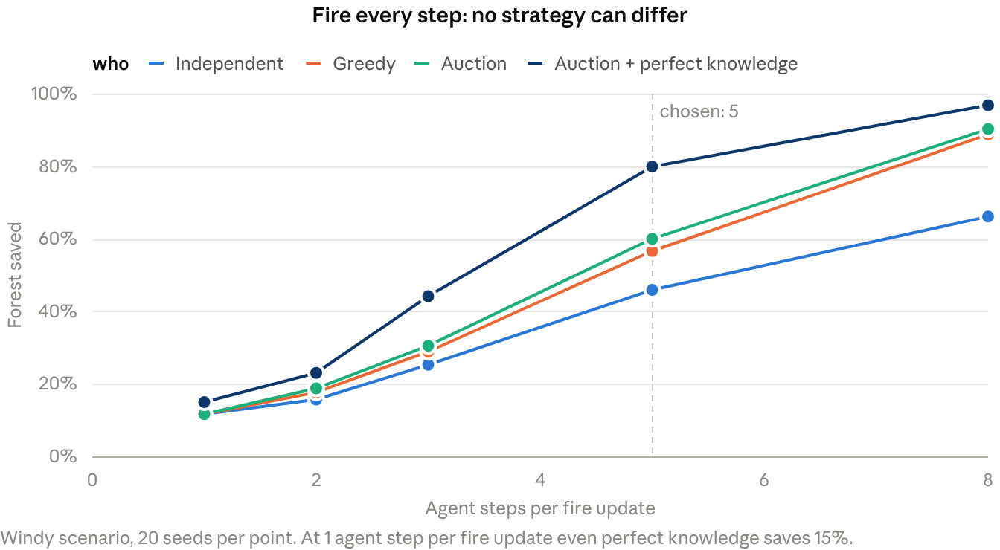
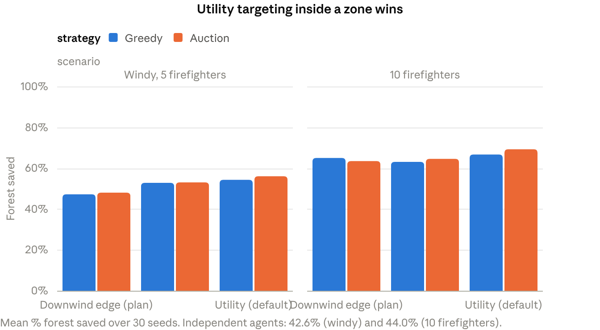

# Wildfire Containment Squad — Study Guide

Sep 27, 2026 · @Adithya Ajay

## How to use this guide

Read sections 2 to 6 once end to end: they explain what the system is and how one simulation step runs. Then study sections 7 to 12 with the code open beside you, and rehearse sections 13 to 15 out loud before the viva.

| If you have | Read | Goal |
| --- | --- | --- |
| 15 minutes | 2, 11, 16 | Say what the project is and what it found, with numbers |
| 1 hour | 2 to 6, 11, 14 | Explain every agent, the step order and the results; answer the common questions |
| An evening | Everything, with the code open | Defend every design decision and walk through any file on request |

Three things to memorise word for word:

1. **The one-line pitch:** scouts find the fire, a Coordinator auctions fire zones, firefighters bid and fight with risk-aware A\*; on the same fires, the coordinated team saves up to 25 percentage points more forest than independent agents.
2. **The step order:** scouts, then Coordinator, then firefighters in id order, then fire spread, then the safety check, then metrics.
3. **The honest finding:** the shared map and coordinated targeting give most of the gain; the auction beats greedy allocation only when several fires compete (Scenario 3).

Every number in this guide comes from `wildfire_squad/results/` and `results/studies/` (720 main runs + 1,090 study runs, 27 September 2026). If you rerun the experiments, the numbers stay the same, because every run is seeded.

## The project in one page

Wildfire Containment Squad is a Python simulation (Mesa 3.5) in which 3 Scout Drones, 5 Firefighters and 1 Coordinator contain a wind-driven wildfire on a 50 × 50 forest grid. On the same fires, the coordinated team saves 4 to 25 percentage points more forest than independent agents in 7 of 8 test configurations.

**The problem.** A wildfire spreads faster than one responder can act, smoke limits what anyone can see, and wind changes where the fire runs. Containment needs three things at once: finding the fire, deciding who fights which part, and moving there safely. No single agent can see or reach the whole fire, which is why it is a multi-agent problem.

*system architecture · 3 agent types, 1 shared map, 1 environment*

Read the loop from the bottom left. The environment gives each agent only what is near it, scouts write that into the shared belief map, the Coordinator turns the map into fire zones and auctions them, firefighters bid, travel and act, and their actions change the environment.

**What was built** (folder `wildfire_squad/`, about 3,300 lines of Python plus 900 lines of tests):

- A stochastic fire model with the exact Review 1 formula and parameters.
- Three agent types with their own sensing, memory and decision rules, talking only through messages and the shared map.
- Three strategies on identical fires: **independent** (no sharing), **greedy nearest** (shared map, nearest firefighter per zone) and **auction** (the full system).
- A live browser demo, 114 automated tests, 720 experiment runs over the six Review 1 scenarios and 1,090 runs of supporting studies.

**Headline results** (30 seeds per scenario, paired on the same fires):

- The full system beats independent agents significantly in 7 of 8 configurations: +13.5 points with strong wind, +11.1 with the river, +25.3 with 10 firefighters.
- The gain grows with team size: +4.1, +13.5 and +25.3 points for 2, 5 and 10 firefighters.
- The auction beats greedy allocation significantly only with 3 simultaneous fires (+1.2 ± 0.9), exactly the case Review 1 argued for; elsewhere they tie.
- Risk-aware A\* expands 63% fewer nodes than uniform-cost search for the same optimal paths.
- Firefighters are caught in about 0.1 cases per run.

## The rubric and where each mark is earned

Each of the eight criteria (20 marks in total) has concrete evidence you can point to. Review 1 is the design report; Review 2 is this implementation.

| Review | Criterion | Marks | Evidence to point at | What to say |
| --- | --- | --- | --- | --- |
| 1 | PEAS formulation | 3 | Review 1 §3: a PEAS table for each agent + one shared score formula | Each agent perceives and acts differently, so each has its own PEAS; all three share one score, so their goals pull the same way |
| 1 | Environment & agent analysis | 3 | Review 1 §4–5: 7 environment properties with justification; architecture table with "why not simpler" | Partially observable + stochastic + dynamic + multi-agent is the hardest combination; every design choice answers one of them |
| 1 | Algorithmic modeling & search strategy | 3 | Review 1 §6–7: formal problem formulation, A\* admissibility argument, auction formula, comparison tables | A\* is the only candidate that is optimal with risk costs and fast enough to replan; the auction is decentralised and cheap to rerun |
| 1 | Q&A & presentation | 1 | Review 1 §10 + section 14 of this guide | Short, confident answers with a number or a test behind each |
| 2 | Tool/package selection & setup | 3 | README §1: tool table with reasons, pinned `requirements.txt`, `setup.bat` / `setup.sh`, clean installs verified on Python 3.12 and 3.13 | Mesa is built for agent-based models; NumPy vectorises the fire; setup is one command |
| 2 | Multi-agent execution & interaction | 3 | `messages.py` (7 message types on one bus), shared belief map, auction log and message counts in the demo, `test_auction.py`, `test_coordination.py` | Agents genuinely depend on each other: scouts feed the map, the Coordinator allocates from it, firefighters bid and report back |
| 2 | Demo quality & testing scenarios | 3 | Live demo with belief-map toggle, Compare button and Coordinator-failure switch; 114 tests at 89% coverage; 6 scenarios × 3 strategies × 30 seeds + 4 studies | Every claim has a test or a chart; comparisons are paired on identical fires |
| 2 | Code structure & scalability | 1 | Package layout, Mesa-free `algorithms/`, everything in `config.yaml`, `test_scales_to_any_agent_count` (0–30 agents) | Change a number in the config, not the code |

**Where marks are most at risk, and the answer ready for each:**

- *"Your results don't fully match Review 1's prediction."* Section 11 has the honest comparison: confirmed for Scenario 2 and team scaling, partly for Scenario 3, not for auction vs greedy in general, with the reason.
- *"Why do agents act 5 times per fire update?"* Section 12.1: at the literal timing even perfect knowledge saves only 15%, so no strategy can be compared.
- *"You changed the plan's firebreak rule."* Section 12.2: Review 1 itself calls the firefighter utility-based; the utility rule saves 8 points more, with a 95% confidence interval that excludes zero.

## The environment

The world is a 50 × 50 grid of cells indexed `(x, y)`, where a wind-driven fire spreads by chance every 5 agent steps. It is partially observable, stochastic, sequential, dynamic, discrete and multi-agent.

### Cells and the map

| State | Value | Can burn? | Firefighter can enter? |
| --- | --- | --- | --- |
| Empty | 0 | No | Yes |
| Tree | 1 | Yes (fuel 1.0 dense, 0.5 sparse) | Yes |
| Burning | 2 | Already burning | No |
| Burnt | 3 | No | Yes |
| Firebreak | 4 | No | Yes |
| Water | 5 | No | No (refill next to it) |
| Unknown | −1 | Belief map only | Treated as passable |

The random map has 2 lakes, 85% of land is Tree, and 30% of trees sit in rectangular sparse patches (the light-green squares in the demo). All agents start at the base station `(2, 2)`. Ignitions are Tree cells at least 15 cells from the base. The **river** preset puts a water column at x = 25 with two 3-cell crossings (y = 10–12 and 38–40) and the fire on the far bank. Code: `environment/forest.py`.

### How fire spreads

Each fire update, a Tree cell n next to a Burning cell b ignites with this probability:

$$
P(\text{ignite from } b) = p_{\text{base}} \times \text{fuel}(n) \times \left(1 + k \cos\theta\right)
$$

Here p\_base = 0.3, k = 0.8 and θ is the angle between the wind and the direction from b to n. Several burning neighbours act as independent chances:

$$
P(\text{ignite}) = 1 - \prod_{b} \left(1 - P(\text{ignite from } b)\right)
$$

A burning cell becomes Burnt after 4 fire updates. Empty, Water, Burnt and Firebreak cells never ignite. Code: `environment/fire.py` (`ignition_probability`, `spread_step`, vectorised with NumPy).

**Worked example** (wind blowing east, dense fuel):

| Neighbour direction from the fire | cos θ | P per update | P within 4 updates |
| --- | --- | --- | --- |
| Downwind (east) | 1.00 | 0.3 × 1.8 = 0.54 | 0.96 |
| Diagonal downwind | 0.71 | 0.47 | 0.92 |
| Crosswind (north/south) | 0.00 | 0.30 | 0.76 |
| Diagonal upwind | −0.71 | 0.13 | 0.43 |
| Upwind (west) | −1.00 | 0.3 × 0.2 = 0.06 | 0.22 |

Sparse fuel halves every value in the "per update" column. With two burning neighbours, one downwind (0.54) and one crosswind (0.30), the cell ignites with 1 − 0.46 × 0.70 = 0.68. `test_fire.py` checks the 1.8× and 0.2× factors exactly.

### Time scale

Agents act every step; the fire updates every 5 steps (`fire.spread_every: 5`). Every Review 1 probability is unchanged; agents simply get 5 actions per fire update. At 1 (a fire update every step) the fire burns about 90% of the forest in roughly 100 steps and no strategy, not even one with perfect knowledge, saves more than 15% (section 12.1).

### When a run ends and how it is scored

A run ends when no cell is burning (contained) or at t\_max = 300 steps. The Review 1 score is:

$$
\text{Score} = 0.7 \cdot \frac{T_{\text{saved}}}{T_{\text{initial}}} - 0.2 \cdot \frac{t_{\text{contain}}}{t_{\max}} - 0.1 \cdot \frac{A_{\text{lost}}}{A_{\text{total}}}
$$

T is Tree cells (firebreaks do not count as saved), t is steps (t\_max if never contained) and A is firefighters. The primary metric in every chart is **% forest saved** = trees standing at the end ÷ trees at the start × 100. Code: `WildfireModel.score`, `final_metrics`.

## The three agents

Scouts perceive, the Coordinator decides who goes where, and firefighters act; none of them can contain the fire alone. All three share one performance measure, the score in section 4.

### PEAS

| Agent | Performance | Environment | Actuators | Sensors |
| --- | --- | --- | --- | --- |
| Scout Drone (3) | Fire found early; grid explored; low belief-map staleness | Forest seen from above; cannot be harmed by fire | Fly 1 cell in 8 directions or hover; broadcast OBSERVE and TARGET | Camera radius 3 (cell states); wind sensor; own position |
| Firefighter (5) | Cells extinguished; firebreaks cut; zones contained; never caught | Forest on the ground; fire, water, other firefighters; 10 units of water | Move 1 cell in 4 directions; extinguish an adjacent burning cell; cut a firebreak; refill next to water; send BID and DONE | View radius 1; the shared map; own position and water; ANNOUNCE, AWARD, REVOKE |
| Coordinator (1) | Short travel for assignments; every zone covered; few idle firefighters | The shared map and the firefighter team; no body on the grid | Send ANNOUNCE, AWARD, REVOKE | The shared map; BID and DONE messages |

### Architecture and memory

| Agent | Architecture | Internal state (in code) | Why not simpler |
| --- | --- | --- | --- |
| Scout Drone | Model-based, goal-based | The shared belief map; its current target and when it chose it | A reflex scout circles the fire it already sees and never finds new ignitions |
| Firefighter | Model-based, utility-based | Position, water, assigned zone, target cell, A\* path, steps since planning, when it started refilling | A goal-based firefighter treats every burning cell as equally good; utility prefers cells that stop the most spread per step of travel |
| Coordinator | Utility-based | Zone table (id, cells, threat, reference cell), assignments firefighter → zone | It trades off distance, threat and water across the whole team, which needs a number |

### Scout decision cycle (`agents/scout.py`)

1. **Sense** every cell within radius 3 and send one OBSERVE to the belief map.
2. **Choose a goal** only when it has none, has reached it, or someone has seen it since it was chosen: the frontier cell with the highest value = age ÷ (1 + distance), skipping cells within 5 of another scout's target.
3. **Publish** the target in a TARGET message so other scouts avoid it.
4. **Fly** one cell straight toward it (it flies, so no path search is needed).

### Firefighter decision cycle (`agents/firefighter.py`)

Every step it senses radius 1, reports DONE(contained) if nothing of its zone still burns, then takes **exactly one** action by priority:

1. **Safety first:** standing on a Tree with fire in any of the 8 neighbours → cut its own cell into a firebreak.
2. **Out of water** → walk to the nearest water-side cell; refill to 10 when next to water.
3. **Burning cell next to it** (4 directions) → extinguish the one with the highest downwind spread probability (costs 1 water).
4. **Standing on its firebreak target** and it is a Tree → cut a firebreak.
5. **Otherwise** → take one step of the risk-aware A\* path toward its target.

Where the target comes from depends on its situation:

| Situation | Target |
| --- | --- |
| Holds a zone (auction or greedy) | The zone's burning cell with the highest spread threatened ÷ (1 + distance), skipping cells a teammate targets; if none, the zone's downwind edge |
| Free, no fire known anywhere | A frontier cell to explore, like a scout |
| Free, fire known, waiting for an AWARD | Holds position (the Coordinator usually awards it within a step) |
| No AWARD for 10 steps (Coordinator silent) | **Fallback:** the nearest known burning cell |
| Independent strategy | The nearest burning cell in its **private** map, else explore |

When bidding it computes U(f, z) (section 7) with a real A\* path cost, so an unreachable zone gets no bid.

### Coordinator decision cycle (`agents/coordinator.py`)

1. **Every 5 steps:** cluster believed-burning cells into zones (8-connected components), keep zone ids stable by maximum overlap, and score each zone's threat.
2. **Release:** take zones back (REVOKE) from firefighters that were lost, refilled for more than 15 steps, or whose zone has disappeared.
3. **Allocate:** fill each zone's slots (1, or 2 for zones above 20 cells) by sequential auction, highest threat first; then give each still-free firefighter one extra slot so nobody idles.
4. **Between rounds:** as soon as a firefighter becomes free, allocate it immediately (event-driven).
5. **Failure test:** from `coordinator.fail_at_step` it does nothing at all.

## One simulation step, the messages, and an auction round

`WildfireModel.step()` in `model.py` runs the same six stages every step, in a fixed order, so every run is reproducible and every conflict has a defined winner.

*one simulation step · WildfireModel.step() · 6 stages*

Firefighters act before the fire spreads, so a firefighter that cuts its own cell to a firebreak in stage 3 is safe in stage 4. The fire only moves on steps 5, 10, 15 and so on; on the other four steps the world changes only through the agents.

### The message protocol (`messages.py`)

Every interaction goes through one `MessageBus` with instant delivery. It counts each type, which is what the demo shows as "Messages".

| Message | From → to | Carries | When |
| --- | --- | --- | --- |
| OBSERVE | Scout or firefighter → belief map | Cell states seen + the step | Every step, every agent (firefighters only with the shared map) |
| TARGET | Scout (or exploring firefighter) → the others | The frontier cell it heads for | When it picks a new target |
| ANNOUNCE | Coordinator → each free firefighter | Zone id, cells, threat, reference cell | For every open slot of a zone, in the auction |
| BID | Firefighter → Coordinator | Zone id, utility U(f, z) | In reply to ANNOUNCE, only if U > 0 |
| AWARD | Coordinator → winner | Zone id, reference cell | After the bids for that slot close |
| DONE | Firefighter → Coordinator | Zone id, `contained` or `abandoned` | Zone no longer burns, or no safe path exists |
| REVOKE | Coordinator → firefighter | Zone id, reason (`absent`, `zone_gone`) | Refilling for more than 15 steps, or the zone disappeared (lets the Coordinator take a zone back) |

### A worked auction round (illustrative numbers)

The Coordinator knows two zones: **Z1** has 30 burning cells and threat 4.2; **Z2** has 8 cells and threat 1.5. Three firefighters are free. Each bids U = threat ÷ (1 + A\* path cost) × water ÷ 10.

| Firefighter | Water | Path cost to Z1 | Path cost to Z2 | Bid for Z1 | Bid for Z2 |
| --- | --- | --- | --- | --- | --- |
| FF5 | 10 | 14 | 6 | 4.2 ÷ 15 × 1.0 = **0.280** | 1.5 ÷ 7 × 1.0 = 0.214 |
| FF6 | 4 | 9 | 20 | 4.2 ÷ 10 × 0.4 = 0.168 | 1.5 ÷ 21 × 0.4 = 0.029 |
| FF7 | 10 | 25 | 10 | 4.2 ÷ 26 × 1.0 = 0.162 | 1.5 ÷ 11 × 1.0 = 0.136 |

1. Z1 goes first because its threat is higher, and it gets **2 slots** because it has more than 20 cells.
2. Slot 1: ANNOUNCE to FF5, FF6, FF7 → bids 0.280, 0.168, 0.162 → **AWARD to FF5**.
3. Slot 2: FF5 has left the pool → bids 0.168, 0.162 → **AWARD to FF6**.
4. Z2, 1 slot: only FF7 is left → bid 0.136 → **AWARD to FF7**.

Greedy nearest would take zones in discovery order, ignore threat and water, and could send full-water FF5 to the small fire while half-empty FF6 faces the large one. Ties go to the lower id (`pick_winner`); a firefighter that cannot reach a zone bids nothing. After these design slots, any firefighter still free gets one extra "support" slot so nobody idles.

## Algorithms in depth

Five algorithms do the work: a timestamped belief map (perception), frontier exploration (scouts), connected-component zones (Coordinator), risk-aware A\* (navigation) and a sequential single-item auction (allocation). All live in `algorithms/` or `belief_map.py` as plain functions with no Mesa dependency, so each is unit-tested on its own.

### 1. Shared belief map (`belief_map.py`)

For every cell it stores the last observed state (−1 = unknown) and `seen_step`, the step it was observed.

- **Fusion rule:** an observation is written only if its step ≥ the stored step, so the **newest timestamp wins** and a late, older report is ignored.
- **Age** = current step − `seen_step`; a cell is **stale** when its age exceeds 15.
- **Terrain prior:** agents know where water is (a map of the forest), not where the fire is.
- In the independent strategy each firefighter has its **own private** map and never sees scout data.

### 2. Frontier exploration (`algorithms/frontier.py`)

Candidates are unknown or stale cells; the **frontier** is the candidates next to a known, fresh cell. A scout at position p picks:

$$
\text{target} = \arg\max_{c \in \text{frontier}} \frac{\text{age}(c)}{1 + \text{chebyshev}(p, c)}, \qquad \text{age}(\text{unknown}) = t_{\max} + 1 = 301
$$

Cells within 5 (Chebyshev) of another scout's published target are skipped. If that rules out the whole frontier (early on, when it is a small ring round the base), every unknown or stale cell becomes a candidate. The scout re-picks only when it reaches the target or anyone observes it. Three scouts explore more than 80% of the map (`test_scouts.py`).

### 3. Fire zones and threat (`algorithms/zones.py`)

- **Clustering:** believed-burning cells are grouped into 8-connected components by breadth-first search.
- **Stable ids:** each old zone's id goes to the new component that overlaps it most. A merge keeps the id with the largest overlap; in a split the largest piece keeps the id and the rest get new ids; a zone with no successor is removed (its firefighters get REVOKE).
- **Live zones:** between clustering rounds a firefighter tracks its zone as the burning cells connected to the last snapshot, so it never chases a cell that has already burnt out.

$$
\text{threat}(z) = |z| \times \operatorname{mean}_{n \in N(z)} \max_{b \in z,\ b \sim n} P(\text{ignite } n \text{ from } b)
$$

N(z) is the believed-Tree cells touching the zone. A big zone with wind pushing it into dense forest scores highest. Each zone also gets a **reference cell** on its downwind edge, the cell used to price bids.

### 4. Risk-aware A\* (`algorithms/astar.py`)

The search runs on a 4-connected grid; Burning and Water cells cannot be entered. Entering cell n costs:

$$
c(n) = 1 + \lambda \cdot \text{risk}(n), \qquad \text{risk}(n) = \max_{b \text{ burning next to } n} P(\text{ignite } n \text{ from } b), \qquad \lambda = 5
$$

So a step costs 1 far from fire and up to 1 + 5 × 0.54 = 3.7 right downwind of it. The heuristic is Manhattan distance to the nearest goal cell (the target, or its free neighbours if the target itself is burning):

$$
h(n) = \min_{g \in \text{goals}} \left(|x_n - x_g| + |y_n - y_g|\right)
$$

- **Admissible:** every move changes x or y by exactly 1 and costs at least 1, so the true remaining cost is at least the number of moves, which is at least h(n). A\* therefore returns an optimal path.
- **Consistent:** h changes by at most 1 per move while each move costs at least 1, so h(n) ≤ c(n → n′) + h(n′) and no node is expanded twice.
- **Implementation:** `heapq` ordered by (f, h, counter) → ties prefer nodes closer to the goal, then insertion order; a closed set; it returns `(path, cost, nodes_expanded)`.
- **UCS** is the same function with h = 0. Every A\* query in the experiments is repeated with UCS for measurement only: same cost, 63% fewer nodes for A\*.
- **Replanning:** when the next cell is burning or blocked, every 10 steps, or when the target changes; no path → DONE(abandoned) and the zone is re-auctioned.
- **Reservations** block only the first move (other firefighters' cells this step). If the only way on is through a reserved cell, the firefighter keeps that path and waits.

### 5. Sequential single-item auction (`algorithms/auction.py`)

$$
U(f, z) = \frac{\text{threat}(z)}{1 + \text{pathcost}(f, z)} \times \frac{\text{water}_f}{\text{water}_{\max}}
$$

- Zones are auctioned in decreasing threat; a zone above 20 cells has 2 slots.
- For each slot: ANNOUNCE to every free firefighter, collect positive BIDs, AWARD the highest (tie → lower id), remove the winner from the pool, repeat.
- Unreachable (infinite path cost) or no water → U = 0 → no bid.
- **Cost:** about Z × F A\* calls per round (Z zones, F free firefighters, both usually under 10). The Hungarian algorithm would be optimal for one snapshot but is O(n³), fully central, and must be recomputed every time zones change.
- **Greedy baseline** (`greedy_assignment`): zones in discovery order, each slot to the nearest free firefighter by straight-line distance; ignores threat and water.

### 6. Choosing a cell inside the zone

Once assigned, a firefighter picks the zone's burning cell b with the highest:

$$
\text{value}(b) = \frac{\sum_{n \text{ fuel next to } b} P(\text{ignite } n \text{ from } b)}{1 + \text{manhattan}(\text{firefighter}, b)}
$$

This means "spread stopped per step of travel". Cells a teammate already targets are skipped. It is the utility-based behaviour Review 1 describes, and it saves 8 points more than the plan's downwind-edge rule (section 12.2).

## Conflicts and how each is resolved

Every conflict that can arise between agents has one deterministic rule and a test that checks it. The first six are the Review 1 conflict table; the last three are the recovery rules the design adds.

| Conflict | Example | Rule | Code | Test |
| --- | --- | --- | --- | --- |
| Two firefighters want the same zone | Both are close to the biggest fire | Auction: higher utility wins, tie → lower id; the loser bids on the next zone | `sequential_auction`, `pick_winner` | `test_zones_auctioned_by_threat_and_loser_bids_on_next` |
| Two firefighters want the same cell in one step | Paths cross in a narrow gap | They act in id order; each current and newly entered cell is reserved; a later firefighter waits, and replans after 2 blocked steps | `WildfireModel.step`, `Firefighter._go_to` | `test_two_firefighters_never_share_a_cell`, corridor test |
| Two scouts head for the same area | Both rate one stale region highest | Published TARGET messages; cells within 5 of another scout's target are excluded | `select_target` | `test_scout_targets_respect_exclusion_radius` |
| Conflicting observations of one cell | Scout saw it burning at step 40; a firefighter saw it burnt at step 42 | Newest timestamp wins | `BeliefMap.observe` | `test_newest_observation_wins`, `test_older_observation_is_ignored` |
| Path blocked by new fire | The front crosses a planned route | Replan with A\*; no safe path → DONE(abandoned) and the zone is re-announced | `_go_to`, `_send_done` | `test_firefighter_replans_when_path_blocked_by_fire`, `test_abandoned_zone_is_offered_again` |
| Out of water mid-task | Water hits 0 inside the zone | Go to refill and keep the zone; after 15 steps away the Coordinator REVOKEs and re-auctions it | `_refill`, `release_absent` | `test_absent_firefighter_is_reauctioned` |
| An idle firefighter blocks the only route | The one at the base is walled in by 4 teammates | The blocked one asks; the idle one steps aside to a free cell | `request_yield`, `_yield_if_asked` | `test_boxed_in_firefighter_is_not_deadlocked` |
| Zones merge or split | Two fronts join | Merge keeps the id with the largest overlap; a split's largest piece keeps the id; firefighters of a vanished zone get REVOKE | `match_zones`, `recluster` | `test_merge_...`, `test_split_...` |
| The Coordinator goes silent | It fails at step 60 | After 10 steps without an AWARD, each firefighter attacks the nearest known fire on its own | `_await_award_or_fallback` | `test_coordinator_failure_triggers_fallback` |

The first rule is **negotiation**, the second and third are **reservations of shared resources**, the fourth is **belief fusion**, and the rest are **replanning and recovery**. That covers the kinds of interaction the "Multi-Agent Execution & Interaction" criterion lists: communication, negotiation, cooperation and conflict resolution.

## Code tour

The code splits into four layers: the environment, pure algorithms, agents, and the model that runs them; the demo and experiment scripts sit on top. Read it in the order of this table.

| Order | File | Lines | What to find there |
| --- | --- | --- | --- |
| 1 | `config.yaml` | 85 | Every parameter; values marked `impl` are implementation choices, the rest are Review 1 values |
| 2 | `environment/cells.py`, `fire.py`, `forest.py` | 354 | Cell states; `ignition_probability`, `spread_step`, `risk_map`; map generation and presets |
| 3 | `belief_map.py` | 71 | `observe` (newest wins), `age`, `stale_mask`, `passable_mask` |
| 4 | `algorithms/astar.py` | 142 | `astar`, `ucs`, `plan_path`, `goal_cells` |
| 5 | `algorithms/frontier.py`, `zones.py`, `auction.py` | 442 | `select_target`; `cluster_zones`, `match_zones`, `zone_threat`, `live_zone_cells`; `utility`, `sequential_auction`, `greedy_assignment` |
| 6 | `messages.py` | 120 | The 7 message dataclasses and `MessageBus` |
| 7 | `agents/scout.py` | 87 | `sense`, `choose_target`, `move` |
| 8 | `agents/coordinator.py` | 175 | `recluster`, `release_absent`, `allocate`, `_collect_bids` |
| 9 | `agents/firefighter.py` | 490 | `step` (action priority), `receive` (messages), `bid_utility`, `_choose_zone_target`, `_go_to` (navigation + reservations), fallback |
| 10 | `model.py` | 268 | `WildfireModel.__init__`, `step`, `plan` (A\* + UCS measurement), metrics and `score` |
| 11 | `strategies.py`, `scenarios.py`, `settings.py` | 123 | The three strategies' switches; the six scenarios; config loading and deep-merge |
| 12 | `app.py`, `run_experiments.py`, `run_studies.py` | 1,024 | Demo; main experiment; supporting studies |

### How a run is wired together

1. `WildfireModel(config_overrides, seed)` loads `config.yaml`, deep-merges the overrides (a scenario, a strategy) and seeds Mesa.
2. It creates **three independent random streams** from the seed: one for the map, one for the fire, and Mesa's own for agents. The map and fire are therefore identical for every strategy on the same seed.
3. `build_forest` makes the map and ignitions; the model sets the ignitions burning and creates the `MultiGrid`.
4. It creates the `MessageBus` and the shared `BeliefMap`, and subscribes handlers: OBSERVE → the map, TARGET → the scout and explorer target tables.
5. It creates scouts at the base, a Coordinator (not for independent), and firefighters on distinct base cells, each with the shared map or a private one.
6. `step()` runs the six stages; `run()` loops until contained or step 300 and returns `final_metrics()`.

### Design patterns to name if asked

- **Blackboard:** the shared belief map is a common workspace that agents read and write.
- **Contract net:** ANNOUNCE → BID → AWARD is the classic contract-net protocol for task allocation.
- **Strategy switch:** one code path; `strategies.py` turns sharing and the Coordinator on or off.
- **Pure core, thin shell:** algorithms take arrays and callbacks, so tests call them directly without a simulation.
- **Caching:** `WildfireModel.plan` caches the passable mask and cost grid per belief-map version, so many A\* calls in one step reuse them.

## Strategies, scenarios and how testing is organised

Testing has three layers: 114 automated tests prove each rule works; 720 experiment runs compare the three strategies on the six Review 1 scenarios; 1,090 study runs test the design decisions.

### The three strategies (`strategies.py`)

| Strategy | Shared map? | Coordinator? | Allocation | Role in the study |
| --- | --- | --- | --- | --- |
| Independent | No: each firefighter has a private map (scouts still fly, but nobody reads their map) | No | Each goes to the nearest fire it has seen, or explores | Baseline 1: "no multi-agent coordination" |
| Greedy nearest | Yes | Yes | Zones in discovery order; each slot to the nearest free firefighter | Baseline 2: coordination without the auction |
| Auction | Yes | Yes | Sequential auction on U(f, z), highest threat first | The full system |

All three share the same firefighter code, A\* and safety rules, so a difference in results comes from sharing and allocation alone.

### The six Review 1 scenarios (`scenarios.py`)

| # | Name | Change from default | What it tests |
| --- | --- | --- | --- |
| 1 | calm\_single | Wind k = 0, 1 ignition | Baseline behaviour; fire grows as a ring |
| 2 | windy\_single | Wind k = 0.8, 1 ignition (= default) | Fast directional spread |
| 3 | multi\_ignition | k = 0.4, 3 ignitions ≥ 15 cells apart | Allocation across several zones |
| 4 | no\_scouts | 0 scouts | Value of shared perception |
| 5 | scaling\_2 / \_5 / \_10 | 2, 5 or 10 firefighters | Scalability and diminishing returns |
| 6 | river | Water column at x = 25, two 3-cell crossings, fire on the far bank | Path conflicts and replanning |

One extra map, **competing**, is used only in the allocation study: a slow fire in sparse forest near the base plus a fast fire in dense forest farther away.

### How the experiment is kept fair

- **Paired seeds:** seeds 0–29, and the same seed gives every strategy the same map and the same fire random numbers.
- **Paired statistics:** for each seed, auction minus baseline; the mean and a 95% confidence interval (1.96 × std ÷ √30) are reported, plus how many of the 30 seeds the auction won.
- **Deterministic:** the same seed and config always give the same result (`test_same_seed_same_result`).

### The automated tests (`tests/`, 114 tests, about 40 s)

| File | Tests | Proves |
| --- | --- | --- |
| `test_astar.py` | 31 | A\* cost = UCS cost on 125 random queries, never more nodes, avoids fire, detours at high λ, no path when blocked |
| `test_model_smoke.py` | 18 | Every strategy and scenario runs, 0–30 agents, score formula, determinism |
| `test_coordination.py` | 12 | Re-auction, abandon, event-driven allocation, Coordinator failure + fallback, safety, time scale, presets |
| `test_fire.py` | 9 | The Review 1 fire formula, clipping, burn-out, determinism, ignition placement, river layout |
| `test_auction.py` | 9 | Utility, highest bid wins, tie-break, threat order, 2 slots for big zones, no bid when unreachable, full message flow |
| `test_zones.py` | 8 | Clustering, stable ids, merge/split, threat, downwind targets |
| `test_tools.py` | 8 | Demo helpers, comparison, experiment and study runners end to end |
| `test_conflicts.py` | 7 | No shared cells, corridor waiting, scout exclusion, replanning, no deadlock |
| `test_scouts.py` | 7 | Frontier, exploration > 80%, shared vs private maps |
| `test_belief_map.py` | 5 | Newest wins, older ignored, staleness, passability |

Coverage is 89% of all code; the simulation modules are 93–100% each. The uncovered part is mostly the demo's page layout, which was checked in a real browser instead.

## Results and what they mean

The full system saves the most forest in 6 of 8 configurations and beats independent agents significantly in 7 of 8. Against greedy allocation it wins significantly only with three simultaneous fires.

*results/summary.csv and results/paired\_gains.csv · 8 configurations × 3 strategies × 30 seeds*

Read the second chart like this: a whisker that stays above the grey zero line means the auction is better on the same fires with 95% confidence. Blue (vs independent) clears zero everywhere except three fires; orange (vs greedy) clears it only for three fires.

**Why the bars in the first chart vary so much between scenarios:** some ignitions start in sparse forest and burn out early; others run across the map. That is why every comparison is paired on the same seed; the paired gains remove that variance. S2 and S5-with-5-firefighters are the same default configuration, so their numbers are identical, which also shows the runs are deterministic.

### What each result means

- **Shared perception matters most.** Independent firefighters see 1 cell around them, so they find the fire late and crowd it. With 10 of them they save only 44%; the coordinated team saves 69%.
- **The gain grows with team size** (+4, +13, +25 points for 2, 5, 10 firefighters): extra firefighters are only useful if someone tells them where to go.
- **Without scouts the team still wins** (+6.9): firefighters share one map and publish their exploration targets, so five of them search like one coordinated sweep.
- **The river** is where A\* shows its value: independent firefighters never extinguish a single cell on the far bank; coordinated ones path through the crossings and win on 29 of 30 seeds.
- **Three fires overwhelm five firefighters** under every strategy (at most 6% saved). The auction still beats greedy there, because it sends crews to the most threatening zone first.

### Findings vs the Review 1 hypothesis

Review 1 predicted: *"The full system should save the most forest, with the largest margin in Scenarios 2 and 3."*

| Prediction | Verdict | Evidence |
| --- | --- | --- |
| The full system saves the most | Confirmed | Highest mean in 6 of 8; significantly above independent in 7 of 8 |
| Largest margin in Scenario 2 | Confirmed | +13.5 over independent, among the largest single-fire margins |
| Largest margin in Scenario 3 | Partly | The only scenario where the auction beats greedy significantly (+1.2), but three fires overwhelm five firefighters, so the margin over independent is small |
| The auction beats greedy in general | Not confirmed | Tied within noise elsewhere: with one or two zones there is rarely a real choice to make |

Say it in one sentence: *"Most of the benefit comes from the shared belief map and coordinated targeting; the auction's threat-aware allocation adds a measurable benefit only when several fires compete."*

### Other measured facts

- **A\* vs UCS:** 63% fewer nodes expanded overall (49–87% per scenario) for the same optimal cost.
- **Safety:** 0.10 firefighters caught per run with the auction (0.16 greedy, 0.13 independent).
- **Work done:** about 75 cells extinguished per run by coordinated crews vs 29 by independent ones.
- **Speed:** about 1.4 s per 300-step run, including the UCS measurement.

## Supporting studies and the decisions they justify

Four studies (`run_studies.py`, 1,090 runs) test the choices the implementation had to make. Each decision below has a study or a test behind it, and each is a switch in `config.yaml`, so an evaluator can turn it off and see the difference.

### 12.1 Fire time scale: agents act 5 times per fire update

*results/studies/timing\_summary.csv · 5 time scales × 4 variants × 20 seeds*

With a fire update every step (1 on the x axis) all three strategies save the same 11.6% (auction minus independent = +0.0 ± 0.7), and even firefighters told the true fire state save only 15%. The fire crosses the forest in about 100 steps, faster than any team can act, so at that timing no strategy can be told apart from another. As agents get more actions per update, coordination starts to pay: at 5 the auction gains +14.1 ± 5.7 over independent agents. Every probability stays exactly as in Review 1; only the unit of time changes.

### 12.2 What a firefighter targets inside its zone

*results/studies/tactics\_summary.csv · 2 scenarios × 3 tactics × 2 strategies × 30 seeds*

The implementation plan sent firefighters to the zone's downwind edge, the head of the fire. That is the most dangerous place and the least effective one, because the head outruns anyone working there. Review 1's own agent analysis says the firefighter is utility-based so it can "prefer cells that stop the most future spread". The utility rule does exactly that and saves +8.1 ± 4.2 points more than the downwind-edge rule (windy, auction), so it is the default. The plan's rule is still available as `zone_tactic: firebreak`.

### 12.3 Targeted allocation test

A slow fire in sparse forest near the base plus a fast fire in dense forest farther away, with only 3 firefighters: the case where threat-aware allocation should matter most.

| Variant | Forest saved |
| --- | --- |
| Independent | 22.6% |
| Greedy (8-connected zones) | 30.3% |
| Auction (8-connected zones) | 29.5% |
| Greedy (fragments within 3 cells joined) | 33.4% |
| Auction (fragments within 3 cells joined) | 33.3% |

Auction and greedy tie (−0.8 ± 2.0); both beat independent (+6.9 ± 3.4). The most likely reason: the near fire is found first, so both methods commit crews to it before the far fire is known. Joining fragments helps both by about 3 points, but that departs from the plan's 8-connectivity, so the default stays at 1.

### 12.4 Coordinator failure and the fallback

| Variant | Forest saved |
| --- | --- |
| Independent | 42.6% |
| Auction, Coordinator works | 56.1% |
| Auction, Coordinator fails at step 60, fallback on | 60.7% |
| Auction, Coordinator fails at step 60, no fallback | 43.9% |

Without the fallback a failed Coordinator drops the team to the independent level. With it (no AWARD for 10 steps → attack the nearest known fire), the team keeps working: +16.8 ± 4.9 over no fallback. It even edges out the working Coordinator here (+4.6 ± 4.1): with one fire, once every crew is engaged, "everyone to the nearest fire on the shared map" is as good as zone allocation. This agrees with section 11: the shared map carries most of the gain.

### Every implementation decision at a glance

| Decision | Config key | Why | Evidence |
| --- | --- | --- | --- |
| Agents act 5× per fire update | `fire.spread_every: 5` | At 1, nothing can be compared | 12.1 |
| Utility targeting inside a zone | `firefighter.zone_tactic: utility` | Review 1 calls the firefighter utility-based; +8 points | 12.2 |
| Live zones + event-driven allocation | built in | Crews chased burnt-out cells and idled up to 5 steps | Review 1 §4 "event-driven replanning"; `test_coordination.py` |
| Safety first (cut own cell; no stepping onto fuel near fire on a fire step) | `firefighter.secure_footing` | Losses fell from about 0.9 to 0.1 per run | `test_firefighter_secures_footing_before_anything_else` |
| Fallback after 10 steps without AWARD | `firefighter.award_timeout: 10` | Review 1's single-point-of-failure answer | 12.4 |
| Support rounds for idle firefighters | `coordinator.assign_idle` | Coordinator PEAS: "few idle firefighters"; greedy gets the same | Both strategies |
| Terrain known in advance | built in | Firefighters must know where water is to refill | `BeliefMap.water_prior` |
| Idle firefighters explore | `firefighter.explore_when_idle` | Makes Scenario 4 (no scouts) work | S4 result +6.9 |
| REVOKE message | `messages.py` | A clean way to take back a zone | `test_absent_firefighter_is_reauctioned` |
| Distinct start cells + yielding | built in | Two firefighters never share a cell; no deadlock at base | `test_conflicts.py` |

## Running everything and the demo script

On Windows, double-click `setup.bat` once, then `run_demo.bat`; everything else is one command from the `wildfire_squad` folder. Python 3.12 or newer is required (Mesa 3.5 needs it).

| Task | Windows | Any system | Time |
| --- | --- | --- | --- |
| Install | `setup.bat` | `./setup.sh`, or `pip install -r requirements.txt` in a venv | 1–2 min |
| Live demo | `run_demo.bat` | `solara run app.py` → http://localhost:8765 | starts in \~5 s |
| All tests | `run_tests.bat` | `python -m pytest` | \~40 s |
| Quick experiment check | `run_experiments.bat --quick` | `python run_experiments.py --quick` | \~30 s |
| Full experiment + studies | `run_experiments.bat` | `python run_experiments.py --scenarios all --runs 30` then `python run_studies.py` | \~10 min |
| Rebuild charts only |  | `python run_experiments.py --replot`, `python run_studies.py --replot` | seconds |

**Before the viva:** open the demo on the presenting laptop at least once (the first start is slower), set the zoom so the map and the right panel both fit, and keep `results/paired_gains.png` and `results/studies/timing.png` open in another window as backups.

### The demo, screen by screen

- **Left:** Reset, Play/Pause and Step, speed, then the parameters. Parameters apply only after **Reset**.
- **Centre:** the forest, with scouts (cyan circles), firefighters (yellow squares with their id), zone reference cells (white ×) and the wind arrow. The checkbox switches to the **belief map**: black = never seen, faded = stale.
- **Right:** a line with the current settings (the sliders do not show numbers), % forest saved, zones with threat and crews, each firefighter's water and activity, the **last auction rounds with every bid and the winner**, message counts, recent events.
- **Bottom:** % saved and burning cells over time, and the **Compare** button.

### Five-minute demo script (rehearse it)

1. **Set up:** preset `windy_single`, seed 0, strategy `auction`, then Reset. *Say:* "Three scouts, five firefighters, one Coordinator; wind blows east."
2. **Play.** Scouts fan out (point at the cyan circles). When the fire is found, the right panel fills with ANNOUNCE/BID/AWARD rounds. *Say:* "Each firefighter bids threat ÷ (1 + path cost) × water; the highest bid wins."
3. **Pause, tick Show belief map.** *Say:* "This is what the team knows: black is unexplored, faded is out of date. Firefighters plan on this, not on the truth."
4. **Let it finish:** it is contained at step 195 with 84.7% saved.
5. **Press Compare.** It shows independent 49.5%, greedy 59.5%, auction 84.7% on this exact fire, with the three final maps side by side. *Say:* "Same map, same fire, same random numbers; only the coordination differs."
6. **Preset `river`, Reset, Play** (optional): independent firefighters never reach the far bank; coordinated ones route through the two crossings with A\*.
7. **Coordinator fails at step = 60, Reset, Play** (optional): `fallback` events appear on the right and the crews keep fighting. *Say:* "This answers the single-point-of-failure question from Review 1."

If anything misbehaves, press Reset; if the page hangs, restart `run_demo.bat`. The charts in `results/` show the same story without the live demo.

## Viva question bank

Each answer is short enough to say in about 20 seconds and ends with something you can show. Practise them out loud; when unsure, answer with the number and where it comes from.

### The idea

| Question | Model answer |
| --- | --- |
| Why is this multi-agent and not one smart agent? | No single agent can see or reach the whole fire. Perception (scouts) and action (firefighters) are split, and they depend on each other through the shared map and the auction. The Compare button shows it: +35 points on seed 0. |
| How do the agents actually interact? | Through 7 message types on one bus (OBSERVE, TARGET, ANNOUNCE, BID, AWARD, DONE, REVOKE) and a shared belief map. The demo counts every message. |
| Is the Coordinator "cheating", making it centralised? | It only allocates; each firefighter computes its own bid from its own path cost and water, and decides its own actions. If it fails, firefighters fall back to acting alone (section 12.4). |
| What does each agent optimise? | One shared score: 0.7 × trees saved − 0.2 × time to contain − 0.1 × firefighters lost, so their goals never conflict. |

### PEAS and environment

| Question | Model answer |
| --- | --- |
| Why a separate PEAS per agent? | They sense and act differently: scouts see radius 3 and fly, firefighters see radius 1 and walk, the Coordinator has no body. |
| Why partially observable? | No agent sees the whole grid; the belief map stores what was seen and when. The belief-map toggle shows the unknown and stale areas. |
| Why stochastic? | Ignition is random, 0.3 × fuel × (1 + 0.8 cos θ), so the same state can lead to different next states. |
| Why dynamic and sequential? | The fire moves whether or not agents act, and a firebreak cut now changes what burns later. |
| Why model-based and not reflex? | A reflex agent has no memory of cells it cannot see, and the fire is almost always partly out of view. |
| Why do agents act 5 times per fire update? | With a fire update every step even perfect knowledge saves 15% and all strategies tie; the spread probabilities are unchanged (timing chart, section 12.1). |

### Algorithms

| Question | Model answer |
| --- | --- |
| Why A\* and not BFS? | Step costs differ with fire risk, so BFS (equal costs) is not optimal. DFS is not optimal either, and greedy best-first walks into fire. |
| Is your heuristic admissible? | Yes. Every move costs at least 1 and changes the Manhattan distance by at most 1, so h never overestimates. It is also consistent. `test_astar.py` checks A\* cost = UCS cost on 125 queries. |
| What does A\* gain over UCS? | 63% fewer nodes expanded for identical paths and costs (`astar_vs_ucs.png`). |
| What is risk(n)? | The highest chance that a burning neighbour ignites n on the next update; the step cost is 1 + 5 × risk, so paths bend away from the fire front. |
| What if the fire blocks the path mid-route? | The firefighter replans; with no safe path it sends DONE(abandoned) and the zone is re-auctioned. |
| Why an auction and not the Hungarian algorithm? | Zones change every few steps. The auction is cheap to rerun (about Z × F path searches), uses each agent's own cost, and needs no central recomputation; Hungarian is O(n³) and fully central. |
| Is the auction optimal? | No, sequential single-item auctions are greedy per slot. In exchange they are fast and robust, and in our tests they match or beat greedy nearest. |
| How does threat work? | Zone size × the average chance its neighbouring trees ignite. A big zone pushed by wind into dense forest scores highest and is auctioned first. |
| How do scouts avoid duplicating work? | Each publishes its target; others ignore cells within 5 of it. Value = age ÷ (1 + distance), so they prefer unknown, near cells. |
| Two observations disagree. Which wins? | The newest timestamp (`BeliefMap.observe`). |

### Implementation, testing, results

| Question | Model answer |
| --- | --- |
| Why Mesa? | It is built for agent-based models: agents, grid, seeded randomness and data collection, plus Solara for the browser demo. We use the Mesa 3 API throughout. |
| How do you make the comparison fair? | Paired seeds: the same map and the same fire random numbers for every strategy; we report the per-seed difference with a 95% confidence interval. |
| Does coordination help? | Yes, significantly in 7 of 8 configurations, by up to 25 points, and the gain grows with team size. |
| Why doesn't the auction beat greedy everywhere? | With one or two zones there is rarely a real choice; both assign everyone. It wins significantly where fires compete (Scenario 3). We tested this directly (section 12.3). |
| Did your results match Review 1? | The full system saves the most, confirmed; the largest margins are in Scenario 2 and with more firefighters; Scenario 3 only partly, because three fires overwhelm five firefighters. |
| How do you know it scales? | The same code runs 0 scouts and 1 to 30 firefighters; a test checks it, and Scenario 5 measures 2, 5 and 10. |
| How is it tested? | 114 pytest tests (89% coverage): the fire formula, belief fusion, A\* optimality, auction rules, every conflict rule, robustness and the tools. |
| What did you change from the plan, and why? | Time scale, utility targeting, live zones, safety-first rules, the fallback. Each has a study or test behind it (section 12 table). |
| Is the Coordinator a single point of failure? | It was; now firefighters fall back after 10 silent steps. Demo switch: "Coordinator fails at step". |
| Limitations? | 2D grid; simplified spread; instant, perfect communication; no terrain slope; agents act 5× per fire update; auction ≈ greedy with few zones. |
| Future work? | Communication delays and losses, a decentralised auction with no Coordinator at all, terrain and real GIS maps, learning the targeting utility from data. |

### Design choices an examiner may probe

The Review 1 report describes the design exactly as built, so there are no differences to defend. These five choices still draw questions.

| Question | Say |
| --- | --- |
| Why does the fire update only every 5 steps? | "Ground crews and drones move faster than a fire front, so agents get 5 actions per fire update. With an update every step even perfect knowledge saves only 15% and no strategy can be told apart (timing study). The spread probabilities themselves are unchanged." |
| Why cut a firebreak on the cell you stand on? | "Same actuator, one cell per action, no water. Standing on it makes that cell safe the moment it is cut, which is also the safety rule: losses fell from 0.9 to 0.1 per run." |
| Why is the goal the target itself, not the cell next to it? | "A tree target must be stood on to be cut; a burning target is reached from the next cell, because firefighters cannot enter fire. `goal_cells` in `astar.py` handles both." |
| Where is Mesa's scheduler? | "Mesa 3 removed schedulers; `WildfireModel.step()` calls the agents in a fixed order itself, which also makes every conflict rule deterministic." |
| Why not always attack the downwind edge? | "The head of the fire outruns anyone working there. Picking the cell that stops the most spread per step of travel saves 8 points more (tactics study)." |

## Presentation plan

Plan 14 minutes: 10 minutes of slides around a 4-minute live demo, then questions. Each slide earns a named rubric criterion, and one team member owns each block.

**Team:** Adithya Ajay (CB.SC.U4CSE23102), Amrith B (CB.SC.U4CSE23105), Gowreesh B (CB.SC.U4CSE23119), Vinaayak Kanagaraj (CB.SC.U4CSE23152). The split below is a suggestion; swap blocks freely, but keep one owner per block.

| # | Slide | Time | Speaker | The one sentence to land | Rubric |
| --- | --- | --- | --- | --- | --- |
| 1 | Title | 0:15 | Adithya | "We built and tested the multi-agent wildfire squad designed in Review 1." | — |
| 2 | Recap: problem and architecture | 1:00 | Adithya | "Scouts sense, the Coordinator allocates, firefighters act; no one can do it alone." | Consistency with Review 1 |
| 3 | Tools and setup | 1:00 | Adithya | "Mesa for agents, NumPy for the fire, one-click setup verified on Python 3.12 and 3.13." | Tools & setup (3) |
| 4 | How the agents interact | 1:30 | Amrith | "Six fixed stages per step, seven message types, and a rule for every conflict." | Multi-agent interaction (3) |
| 5 | Algorithms in the code | 1:30 | Amrith | "Risk-aware A\* is optimal and expands 63% fewer nodes than UCS; the auction prices each zone by threat, distance and water." | Multi-agent interaction (3) |
| 6 | Live demo | 4:00 | Gowreesh | Follow the demo script in section 13: auction run, belief map, Compare | Demo quality (3) |
| 7 | How we tested | 1:00 | Vinaayak | "114 tests, six scenarios × three strategies × 30 paired seeds." | Testing scenarios (3) |
| 8 | Results | 1:30 | Vinaayak | "Coordination wins significantly in 7 of 8 configurations, by up to 25 points." | Testing scenarios (3) |
| 9 | Findings vs Review 1 | 1:00 | Vinaayak | "Confirmed overall; the auction beats greedy only where fires compete." | Honesty, Q&A |
| 10 | Decisions backed by studies | 1:00 | Gowreesh | "Every change from the plan has a study behind it." | Execution (3), Q&A |
| 11 | Code structure and scalability | 0:30 | Amrith | "Pure algorithms, one config file, 0 to 30 agents with no code change." | Code structure (1) |
| 12 | Limitations and thanks | 0:30 | Adithya | "2D, instant communication, simplified fire: all future work." | — |

### Delivery rules

- **Open with the pitch** (section 1), not with the tools.
- **Numbers, not adjectives:** "+13.5 points on the same fires", not "much better".
- **Name the honest finding before they ask:** auction ≈ greedy except with competing fires. Owning it reads as rigour; being caught by it reads as a gap.
- **Hand over by name:** "Amrith will now show how the agents talk to each other."
- **In Q&A, whoever owns the slide answers first;** others add only a number or a pointer ("that is in `test_astar.py`").
- **Backup plan:** if the demo fails, go to the Compare screenshot and the charts in `results/`, then keep talking.

## Quick reference

The numbers most likely to be asked for, in one place.

### Parameters

| Parameter | Value | Parameter | Value |
| --- | --- | --- | --- |
| Grid | 50 × 50 | Scouts / firefighters | 3 / 5 |
| Tree density | 85% of land | Sparse trees (fuel 0.5) | 30% of trees |
| p\_base | 0.3 | Wind strength k | 0.8 |
| Downwind / upwind factor | 1.8× / 0.2× | Burn time | 4 fire updates |
| Fire updates | every 5 agent steps | t\_max | 300 steps |
| Scout / firefighter view | radius 3 / 1 | Water | 10, 1 per cell |
| Stale after | 15 steps | Scout target exclusion | 5 cells |
| A\* risk weight λ | 5 | Replan | every 10 steps or when blocked |
| Re-cluster and auction | every 5 steps | Two slots above | 20 cells |
| Re-auction when away | > 15 steps | Fallback after | 10 steps without AWARD |
| Score weights | 0.7 / 0.2 / 0.1 | Base station | (2, 2) |

### Results

| Result | Value |
| --- | --- |
| Configurations where the auction beats independent significantly | 7 of 8 |
| Largest gain over independent | +25.3 points (10 firefighters) |
| Gain with 2 / 5 / 10 firefighters | +4.1 / +13.5 / +25.3 points |
| Auction vs greedy, 3 fires | +1.2 ± 0.9 points (significant) |
| River: auction better than independent | 29 of 30 seeds |
| A\* vs UCS | 63% fewer nodes, same cost |
| Literal timing, all strategies | about 11.6% saved; perfect knowledge 15% |
| Utility targeting vs plan's downwind edge | +8.1 ± 4.2 points |
| Fallback vs no fallback after Coordinator failure | +16.8 ± 4.9 points |
| Firefighters caught per run (auction) | 0.10 |
| Tests / coverage | 114 / 89% |
| Runs | 720 main + 1,090 studies |
| Demo seed 0, windy: independent / greedy / auction | 49.5% / 59.5% / 84.7% (contained at step 195) |

### Glossary

| Term | Meaning here |
| --- | --- |
| Belief map | The team's record of every cell's last seen state and when it was seen |
| Stale | Seen more than 15 steps ago; scouts revisit it |
| Frontier | Unknown or stale cells next to known, fresh ones |
| Zone | A connected group of burning cells auctioned as one task |
| Threat | Zone size × average chance its neighbouring trees ignite |
| Utility U(f, z) | Threat ÷ (1 + path cost) × water fraction: a firefighter's bid |
| Slot | One firefighter position in a zone (1, or 2 above 20 cells) |
| Support round | Extra slots so no firefighter stays idle |
| Admissible heuristic | Never overestimates the remaining cost, so A\* is optimal |
| Consistent heuristic | h(n) ≤ step cost + h(next), so no node is expanded twice |
| Paired comparison | Strategies compared on the same seed, so the fire is identical |
| 95% confidence interval | The range the true mean gain lies in with 95% confidence; not crossing 0 means significant |
| Fallback | Firefighter behaviour when no AWARD arrives: go to the nearest known fire |
| Oracle | Study-only mode where agents see the true fire state (an upper bound) |
| Contract net | The ANNOUNCE → BID → AWARD protocol for handing out tasks |
